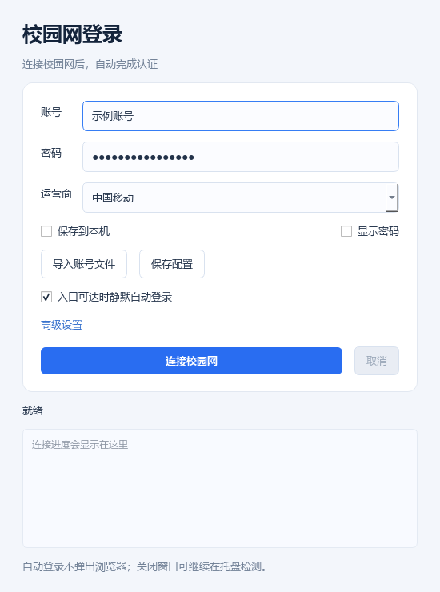
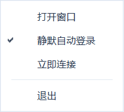

# 校园网自动登录

Windows 校园网登录工具，使用 **PySide6 / Qt** 提供界面，通过 **Playwright + Microsoft Edge** 完成网页认证。支持后台检测、自动填写账号、勾选协议、精确匹配运营商和确认连接，认证结束后关闭浏览器。

默认适配 `10.254.241.66` 的校园网门户，包含 SSO iframe 和运营商二次确认流程。其他门户需要调整入口、表单定位和认证结果判断。

## 下载与使用

在 [Releases](https://github.com/Future-AI-0/campus-login/releases/latest) 下载 Windows x64 版本；无需安装 Python，电脑需要 Microsoft Edge。

| 文件 | 使用方式 |
| --- | --- |
| `CampusLogin-Slim.zip` | 推荐。解压整个文件夹，运行 `CampusLogin.exe`，保持 `_internal` 在旁边。 |
| `CampusLogin-OneFile.zip` | 单文件版。只需 EXE，启动时先把依赖解压到临时目录，因此启动稍慢。 |
| `SHA256SUMS.txt` | 两个压缩包的 SHA-256 校验值。 |

1. 连接校园网 Wi-Fi 或网线，运行 EXE。
2. 填写账号、密码和运营商，点击 **保存配置**；也可以导入一行 `账号|密码|运营商` 格式的 TXT。
3. **入口可达时静默自动登录** 默认开启，每 15 秒检测入口，可达后使用已保存的配置在后台认证。
4. 关闭窗口后继续在系统托盘检测。单击托盘图标或右键选择 **打开窗口** 可恢复窗口，右键还可暂停、立即连接或退出。



程序运行后会在桌面创建或更新“校园网登录”快捷方式，快捷方式默认静默启动；配置不完整时显示设置窗口。程序需要保持运行，不自动随 Windows 开机启动。重复启动会打开已有窗口，避免同时认证。

## 自动登录行为

- 自动登录始终隐藏浏览器，使用已保存的配置；界面上未保存的账号修改不会用于后台登录。
- 失败按 60、120、240、300 秒的间隔重试，之后最多每 5 分钟尝试一次；入口断开后重新可达时立即再试。
- 每次认证只提交一次账号并等待明确结果。已在线时不再提交账号，也不切换当前运营商。
- 明确的账号密码错误或验证码要求会暂停自动登录；点击 **取消** 也会暂停。
- 入口可达只表示可以尝试认证。程序通过门户在线结果或登录成功页面确认成功，普通 HTTP 200、手机热点能上网都不会被判为校园网认证成功。
- 托盘菜单使用白底深色文字、蓝底白字选中项。**打开窗口** 支持初始隐藏、关闭到托盘和最小化状态。



## 配置

只需要三个账号环境变量；也可以在程序旁的 `.env` 中保存：

```dotenv
CAMPUS_USERNAME='你的校园网账号'
CAMPUS_PASSWORD='你的校园网密码'
CAMPUS_OPERATOR='中国移动'
```

进程环境变量优先于 `.env`。密码保留原始内容，包括空格。运营商填写页面上的完整文字，支持 `移动` / `中国移动`、`联通` / `中国联通`、`电信` / `中国电信` 对应别名；无法唯一匹配时停止并显示可选项。

**高级设置** 可调整完整入口、等待时间和手动登录时是否显示浏览器。开关和高级设置保存在 EXE 旁的 `settings.json`，账号也始终保存在 EXE 旁，单文件版不会把个人配置写入临时解压目录。

配置由界面的 **保存配置** 或勾选 **保存到本机** 后点击登录生成。取消勾选仅表示本次不写入，不删除已有文件。源码仓库和 Release 均不包含个人账号文件、`.env` 或 `settings.json`。

默认入口：

```text
http://10.254.241.66/portal/entry/pc/authenticate;flowParams=undefined;from=
```

## 从源码运行

需要 Windows、Python 3.10+ 和 Microsoft Edge。在 PowerShell 中执行：

```powershell
git clone https://github.com/Future-AI-0/campus-login.git
cd campus-login
powershell -ExecutionPolicy Bypass -File .\setup.ps1
.\.venv\Scripts\python.exe .\gui.py
```

也可以双击 `gui.cmd`。从源码运行时，桌面快捷方式会使用该项目的 Python 虚拟环境。

命令行提供单次认证：

```powershell
# 使用项目 .env 或三个环境变量
.\.venv\Scripts\python.exe .\login.py

# 隐藏浏览器
.\.venv\Scripts\python.exe .\login.py --headless

# 仅填入账号并勾选协议，不提交或选择运营商
.\.venv\Scripts\python.exe .\login.py --dry-run

# 延长等待；需要时替换为该门户新生成的完整入口
.\.venv\Scripts\python.exe .\login.py --timeout 90 --url 'http://10.254.241.66/portal/实际完整入口'
```

程序只在指定门户主机的页面中填写凭据。多个输入框或按钮匹配时停止，使用 Playwright 的定位和可操作性等待，不按屏幕坐标填写账号。

## 打包

安装源码依赖后执行：

```powershell
# 精简目录版：dist\CampusLoginSlim\CampusLogin.exe
powershell -ExecutionPolicy Bypass -File .\build.ps1 -CompactDirectory

# 单文件版：dist\Standalone\CampusLogin.exe
powershell -ExecutionPolicy Bypass -File .\build.ps1 -SingleFile
```

两个版本共用 `CampusLogin-slim.spec` 的依赖裁剪规则，移除未使用的 Qt OpenGL 软件渲染器、多语言资源、额外插件，以及 Playwright 类型声明、开发工具页面和非 Windows 安装脚本。保留 Qt Windows / 托盘 / 本机通信、Python HTTPS 和 Playwright 核心运行时；通过电脑已有的 Edge 操作网页。

构建时保留本机已有配置，但生成 ZIP 时只包含明确列出的发布文件，不打包个人配置。精简目录版约 58.9 MiB，单文件压缩包约 58.3 MiB；具体以 Release 附件为准。

## 验证与已知限制

已通过 34 项测试，覆盖 iframe、协议勾选、延迟出现的运营商选择、已在线、认证失败、超时、Qt 后台线程、静默触发、重试、取消、配置保存、托盘菜单配色、窗口恢复和跨进程单实例通信。

还验证了 Windows 托盘右键入口的初始隐藏、关闭到托盘、最小化恢复，并在独立解压目录检查了发布包的 Qt、Edge、菜单、窗口恢复和配置路径。

```powershell
.\.venv\Scripts\python.exe -m unittest discover -s tests -v
```

测试使用模拟门户与测试账号，不会提交真实校园网账号。

实际入口测试时，终端识别接口返回 HTTP 555，尚未完成真实账号认证的端到端验证。若出现此状态，请检查校园网终端注册、网络出口和完整入口。浏览器会禁用显式 HTTP 代理，系统 TUN / VPN 和网卡路由仍可能影响访问。

依赖文档：[Qt for Python](https://doc.qt.io/qtforpython-6/)、[Playwright 定位](https://playwright.dev/python/docs/locators)、[Playwright 打包](https://playwright.dev/python/docs/library#pyinstaller)、[PyInstaller](https://pyinstaller.org/en/stable/)。
